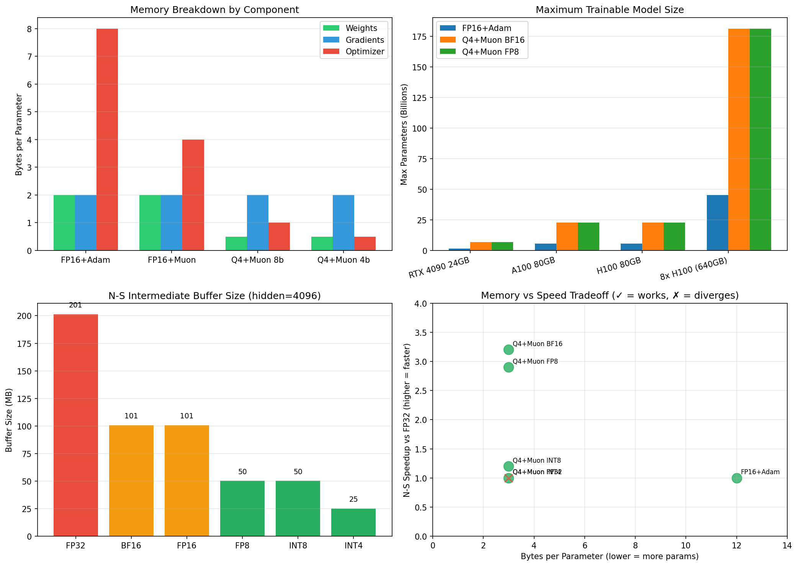

# Newton-Schulz Precision Analysis

## Summary

Newton-Schulz orthogonalization has **much lower precision requirements** than Adam's
optimizer state (no 70+ orders of magnitude dynamic range). This enables aggressive
quantization, but INT4 is still too coarse.

## Precision Comparison (4096x4096 matrix)

| Implementation | Time (ms) | Ortho Error | vs FP32 | Speedup |
|----------------|-----------|-------------|---------|---------|
| FP32 (reference) | 59.96 | 0.259 | 0.000 | 1.0x |
| **BF16** | **18.54** | 0.285 | 0.003 | **3.2x** |
| **FP16** | **17.92** | 0.260 | 0.000 | **3.4x** |
| FP8 E4M3 | 20.42 | 0.285 | 0.003 | 2.9x |
| FP8 E5M2 | 20.05 | 0.285 | 0.003 | 3.0x |
| INT8 (native) | 49.51 | 0.257 | 0.002 | 1.2x |
| INT8 (simulated) | 62.95 | 0.257 | 0.003 | 0.95x |
| INT4 (simulated) | 61.32 | **0.102** | 0.037 | 0.98x |

## Key Findings

### 1. BF16/FP16 is the Sweet Spot

```
Speedup:     3.2-3.4x faster than FP32
Ortho Error: ~0.28 (acceptable)
Precision:   10-bit mantissa (BF16) or 10-bit (FP16)
Support:     Universal GPU support
```

BF16 and FP16 are fastest because:
- Native tensor core support
- Optimized cuBLAS kernels
- No quantization overhead

### 2. FP8 is Underwhelming (on this GPU)

```
FP8 E4M3: 2.9x speedup (slower than BF16!)
FP8 E5M2: 3.0x speedup (still slower than BF16!)
```

Why FP8 isn't winning:
- `torch._scaled_mm` has overhead for scale management
- Our current GPU may not have full FP8 tensor core support
- BF16 matmul is already highly optimized

FP8 might win on H100 with native FP8 tensor cores and better kernel support.

### 3. INT8 Works But Needs Native Kernels

```
INT8 native:    1.2x speedup (vs FP32), but still 2.7x slower than BF16
INT8 simulated: 0.95x (slower due to quant/dequant Python overhead)
Ortho Error:    0.257 (actually BETTER than BF16!)
```

INT8 converges correctly but is bottlenecked by:
- `torch._int_mm` not as optimized as BF16 matmul
- Quantization/dequantization overhead
- No fused quantized matmul kernel

### 4. INT4 Does Not Converge

```
Iterations:  1     2     3     4     5
INT4 Error:  0.99  0.88  0.31  0.13  95.7  ← EXPLODES
BF16 Error:  0.99  0.89  0.31  0.28  0.22  ← Converges
```

16 quantization levels are insufficient for Newton-Schulz:
- X@X.T products need >4 bits of precision
- Error accumulates across iterations
- Diverges after ~4 iterations

## Dynamic Range Analysis

Why Newton-Schulz is easier to quantize than Adam:

| Quantity | Adam v | Newton-Schulz X |
|----------|--------|-----------------|
| Range | 1e-30 to 1e+2 | -0.1 to 0.1 |
| Orders of magnitude | 70+ | ~1 |
| Minimum bits needed | 8 (with log-space) | 8 (direct) |

Newton-Schulz operates on normalized matrices:
```
X = G / ||G||           # Unit norm
X@X.T ∈ [-1, 1]        # Bounded products
Coefficients: ~3, -5, 2 # Small integers
```

## Memory Bandwidth Analysis

For 4096x4096 matrix (per N-S iteration):

| Precision | X size | A=X@X.T size | Total I/O | vs FP32 |
|-----------|--------|--------------|-----------|---------|
| FP32 | 67 MB | 67 MB | 537 MB | 1.0x |
| BF16 | 34 MB | 34 MB | 268 MB | 2.0x less |
| FP8 | 17 MB | 17 MB | 134 MB | 4.0x less |
| INT8 | 17 MB | 17 MB | 134 MB | 4.0x less |
| INT4 | 8 MB | 8 MB | 67 MB | 8.0x less |

Memory bandwidth is the key bottleneck for large matrices. Lower precision
helps even if compute is the same.

## Convergence vs Iterations

All working precisions converge similarly:

| Precision | iter=1 | iter=2 | iter=3 | iter=4 | iter=5 |
|-----------|--------|--------|--------|--------|--------|
| FP32 | 0.990 | 0.889 | 0.307 | 0.271 | 0.214 |
| BF16 | 0.990 | 0.888 | 0.306 | 0.281 | 0.224 |
| FP16 | 0.990 | 0.889 | 0.307 | 0.270 | 0.210 |
| INT8 | 0.990 | 0.889 | 0.309 | 0.272 | 0.215 |
| **INT4** | 0.990 | 0.884 | 0.310 | **0.129** | **95.7** |

5 iterations is standard. All precisions >=8 bits work fine.

## Recommendations

### For Production (Today)

**Use BF16** - it's fastest and universally supported:
```python
X = G.to(torch.bfloat16)
X = X / (X.norm() + 1e-7)
for a, b, c in coeffs:
    A = X @ X.T
    B = b * A + c * (A @ A)
    X = a * X + B @ X
```

### For H100/Blackwell

**Try FP8 E4M3** with proper scaled_mm:
```python
X_fp8 = X.to(torch.float8_e4m3fn)
A = torch._scaled_mm(X_fp8, X_fp8.T, scale_a=1.0, scale_b=1.0, out_dtype=torch.bfloat16)
```

Requires proper scale management and may need custom Triton kernels.

### For Memory-Constrained

**INT8 is viable** but needs better kernel support:
```python
# Native INT8 matmul
scale = X.abs().max() / 127.0
X_q = (X / scale).round().clamp(-128, 127).to(torch.int8)
A_int32 = torch._int_mm(X_q, X_q.T)
A = A_int32.float() * (scale * scale)
```

~20% slower than BF16, but 2x memory savings.

### Do NOT Use

- **INT4**: Doesn't converge, explodes after ~4 iterations
- **FP8 E5M2**: 2-bit mantissa is too imprecise (same error as E4M3 but no benefit)

## Future Work

1. **Fused INT8 N-S kernel**: Eliminate quant/dequant overhead
2. **FP8 Triton kernels**: Better FP8 matmul than torch._scaled_mm
3. **Mixed precision N-S**: BF16 accumulation with FP8/INT8 storage
4. **Stochastic rounding**: Might enable INT4 to converge (doubtful)

## Implementation Files

- `src/phfe/inference/gguf_vtensor/newton_schulz_triton.py` - Triton BF16 kernels
- `scripts/benchmark_ns_precision.py` - This analysis

## Comparison with Adam Optimizer State

| Aspect | Adam v | N-S X matrix |
|--------|--------|--------------|
| Dynamic range | 1e-30 to 1e+2 | ~[-0.1, 0.1] |
| Log-space needed | Yes | No |
| Minimum bits | 8 (with log) | 8 (direct) |
| 4-bit works | No (diverges) | No (diverges) |
| BF16 works | N/A (state is FP32) | Yes (3.2x faster) |

Both require ~8 bits minimum, but N-S benefits from hardware dtype support
while Adam state is stuck with explicit quantization.

## Memory Analysis: Maximum Model Size by GPU

N-S precision affects **speed**, not stored memory. The stored bytes/param is fixed
by weights + gradients + optimizer state.

### Bytes Per Parameter Breakdown

| Configuration | Weights | Grads | Momentum | Total |
|---------------|---------|-------|----------|-------|
| FP16 + Adam (baseline) | 2.0 | 2.0 | 8.0 | **12.0** |
| FP16 + Muon FP32 | 2.0 | 2.0 | 4.0 | 8.0 |
| Q4 + Muon 8-bit | 0.5 | 2.0 | 1.0 | 3.5 |
| **Q4 + Muon 4-bit** | 0.5 | 2.0 | 0.5 | **3.0** |

### Maximum Trainable Model Size

| GPU | FP16+Adam | Q4+Muon 4-bit | Improvement |
|-----|-----------|---------------|-------------|
| RTX 3060 12GB | 833M | **3.4B** | 4.1x |
| RTX 4090 24GB | 1.7B | **6.8B** | 4.0x |
| A100 40GB | 2.8B | **11.3B** | 4.0x |
| A100 80GB | 5.6B | **22.6B** | 4.0x |
| H100 80GB | 5.6B | **22.6B** | 4.0x |
| 8x H100 640GB | 45.3B | **181.3B** | 4.0x |

### N-S Buffer Size (Temporary, per layer)

These buffers are allocated during N-S and freed after:

| N-S Precision | Buffer Size (hidden=4096) | vs FP32 |
|---------------|---------------------------|---------|
| FP32 | 201 MB | 1.0x |
| BF16 | 101 MB | 2.0x smaller |
| FP8 | 50 MB | 4.0x smaller |
| INT8 | 50 MB | 4.0x smaller |
| INT4 | 25 MB | 8.0x smaller (but diverges!) |

### Practical Examples: Training Llama Models

| Model | FP16+Adam | Q4+Muon 4-bit | Min GPUs (baseline) | Min GPUs (ours) |
|-------|-----------|---------------|---------------------|-----------------|
| Llama-7B | 84 GB | 21 GB | 2x H100 | **1x RTX 4090** |
| Llama-13B | 156 GB | 39 GB | 2x H100 | **1x H100** |
| Llama-70B | 840 GB | 210 GB | 11x H100 | **3x H100** |
| Llama-405B | 4860 GB | 1215 GB | 61x H100 | **16x H100** |

## Recommendations by GPU

| GPU | Recommended Config | N-S Precision | Notes |
|-----|-------------------|---------------|-------|
| RTX 3060 | Q4 + Muon 4-bit | BF16 | BF16 fastest, FP8 not worth it |
| RTX 4090 | Q4 + Muon 4-bit | **BF16** | FP8 slower on Ada! |
| A100 | Q4 + Muon 4-bit | BF16 | Good tensor core support |
| H100 | Q4 + Muon 4-bit | **FP8** | Native FP8 tensor cores |
| Blackwell | Q4 + Muon 4-bit | FP8/FP4? | TBD, expect FP8 optimization |

## Key Insight: Why FP8 Loses on Ada

FP8 should be 2x faster due to 2x less memory bandwidth, but:

1. `torch._scaled_mm` has Python overhead for scale management
2. Ada tensor cores have FP8 support but less optimized than Hopper
3. BF16 matmul is extremely optimized in cuBLAS

On H100 (Hopper), FP8 should win because:
1. Native FP8 tensor cores with hardware scaling
2. Better compiler/runtime support for FP8
3. Higher memory bandwidth makes compute more dominant

## Visualization



## Summary Table

| Method | B/param | N-S Speedup | Max 7B GPUs | Works? |
|--------|---------|-------------|-------------|--------|
| FP16+Adam | 12.0 | 1.0x | 2x H100 | ✓ |
| Q4+Muon BF16 | 3.0 | 3.2x | 1x RTX 4090 | ✓ |
| Q4+Muon FP8 | 3.0 | 2.9x* | 1x RTX 4090 | ✓ |
| Q4+Muon INT8 | 3.0 | 1.2x | 1x RTX 4090 | ✓ |
| Q4+Muon INT4 | 3.0 | 1.0x | 1x RTX 4090 | ✗ |

*FP8 slower than BF16 on Ada, should be faster on Hopper
